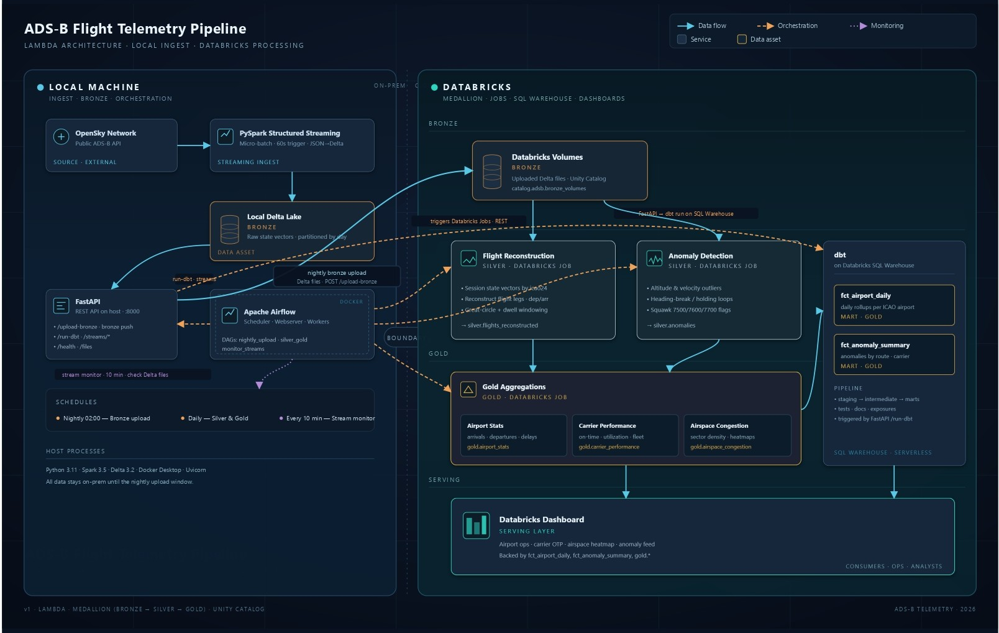
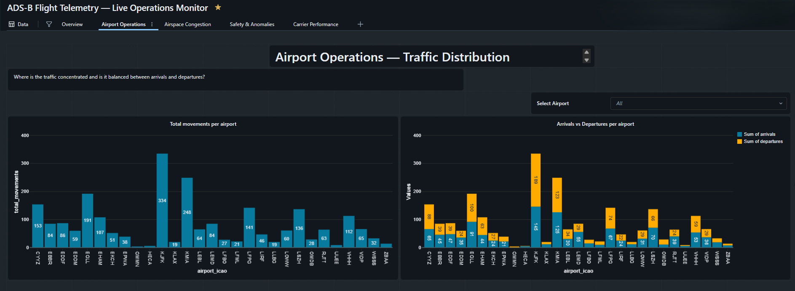

# ✈️ ADS-B Flight Telemetry Pipeline


A production-grade Lambda architecture pipeline that ingests real-time ADS-B aircraft position data from the OpenSky Network, reconstructs logical flights, detects aviation anomalies, and serves business-ready analytics via dbt models and a Databricks dashboard — built entirely on free infrastructure.

---

## Architecture



---

## What It Does

- **Ingests** live ADS-B state vectors from 15,000+ aircraft every 60 seconds via PySpark Structured Streaming
- **Reconstructs** logical flights from raw position snapshots using window functions and geo UDFs
- **Detects** 5 classes of aviation anomalies — emergency squawks, rapid altitude drops, extreme vertical rates, unusual speeds, and signal gaps
- **Aggregates** daily airport statistics, carrier performance metrics, and airspace congestion into gold tables
- **Serves** business-ready analytics via dbt models and a live Databricks SQL dashboard

---

## Dashboard

> Example dashboard built on top of the gold and dbt layers using Databricks SQL dashboards.



---

## Quick Start

> Requires: Python 3.10, Terraform, Docker Desktop, Databricks Free Edition account, Git Bash

```bash
git clone https://github.com/your-username/adsb-flight-telemetry-pipeline.git
cd adsb-flight-telemetry-pipeline
```

### Option A — Automated
```bash
chmod +x setup.sh
./setup.sh
```

### Option B — Manual
```bash
# 1. Install Python dependencies
pip install -r requirements.txt

# 2. Configure credentials
cp terraform/terraform.tfvars.example terraform/terraform.tfvars
# Fill in your Databricks token, OpenSky credentials, and Airflow secrets

# 3. Spin up infrastructure
cd terraform && terraform init && terraform apply && cd ..

# 4. Start the local REST API (keep running)
uvicorn api.main:app --port 8000 --reload

# 5. Start the streaming job (keep running)
python -m spark.jobs.01_stream_ingest

# 6. Add FastAPI connection in Airflow UI
# http://localhost:8080 → Admin → Connections
# Conn ID: fastapi_default | Type: HTTP | Host: http://host.docker.internal | Port: 8000

# 7. Trigger the nightly batch manually or wait for 2am UTC
```
---

## Detailed Documentation

| Document | Contents |
|---|---|
| [`docs/DETAILS.md`](docs/DETAILS.md) | Full technical walkthrough |
| [`spark/NOTES.md`](spark/NOTES.md) | Segmentation limitations, mock data rationale, future improvements |
| [`airflow/NOTES.md`](airflow/NOTES.md) | Orchestration constraints, FastAPI bridge setup |
| [`api/README.md`](api/README.md) | REST API endpoints, OS compatibility notes |

---

## Stack

| Layer | Technology |
|---|---|
| Ingestion | PySpark Structured Streaming, OpenSky Network API |
| Storage | Delta Lake, Databricks Unity Catalog Volumes |
| Transformation | PySpark, Databricks Notebooks, Databricks Jobs |
| Orchestration | Apache Airflow 2.9 (Docker), FastAPI bridge |
| Serving | dbt 1.11, Databricks SQL Warehouse |
| Infrastructure | Terraform (Docker + Databricks providers) |
| CI/CD | GitHub Actions |
| Cost | $0 |